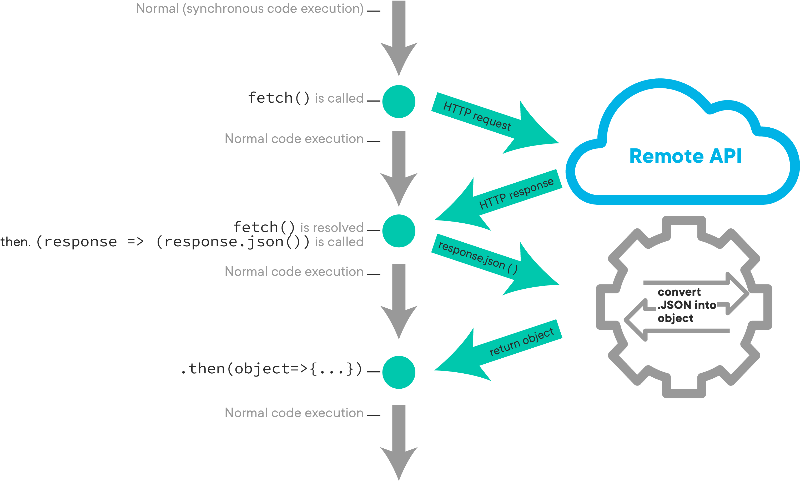

# Intro to AJAX and Fetch

> **Ayana Zaire Cotton on 01/21/20**

* The `Promise` is the yin to fetch's yang
* Can make `fetch` requests to helper methods on the back-end
* When to put logic in the front-end vs. back-end
  * If manipulating the database, put it in the back-end
  * If manipulating the DOM, put it in the front-end

## **POST Fetch**

* The really important parts are the `method`, `headers`, and `body` keys
  * The `headers` key is akin to `strong params` in Rails

## **PATCH Fetch**

* Need to know what it is that we what to edit
* Requires DOM manipulation
  * The best way to do it is to use the HTML attribute `dataset` or `data-id` to grab the DOM element

> **Ayana Zaire Cotton on 02/04/20**

**JavaScript Mantra: When** _**some event**_ **happens, I want to make** _**what kind of**_ **fetch and then manipulate the DOM** _**in what way**_**?**

* AJAX = Asynchronous JavaScript in XML
  * The general way we make requests to the server without reloading the web page
  * Relies on Promises and JSON \(JavaScript Object Notation\)
* Promises are objects
  * They're either pending, fulfilled, or rejected
* Look into HTTP `OPTIONS` method
  * [OPTIONS \(MDN\)](https://developer.mozilla.org/en-US/docs/Web/HTTP/Methods/OPTIONS)

> **Ayana Zaire Cotton on 02/18/20**

* Responses are objects, much like Promises

> **Ayana Zaire Cotton on 03/17/20**

* Some methods we can call on the `Promise`:
  * `.then()`
  * `.catch()`
  * `.finally()`
* Some methods we can call on the `Response`:
  * `.json()`
  * `.text()`

A `fetch()` request cycles through the above methods, returning `Promise`–`Response`–`Promise`

