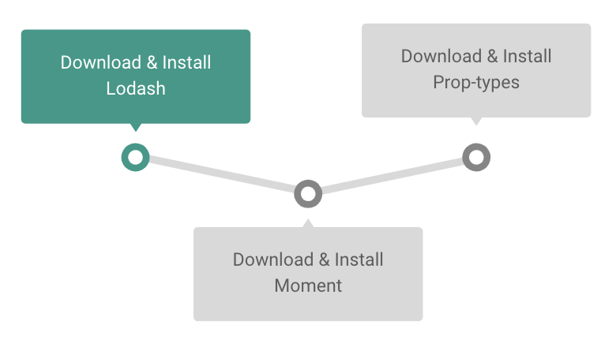
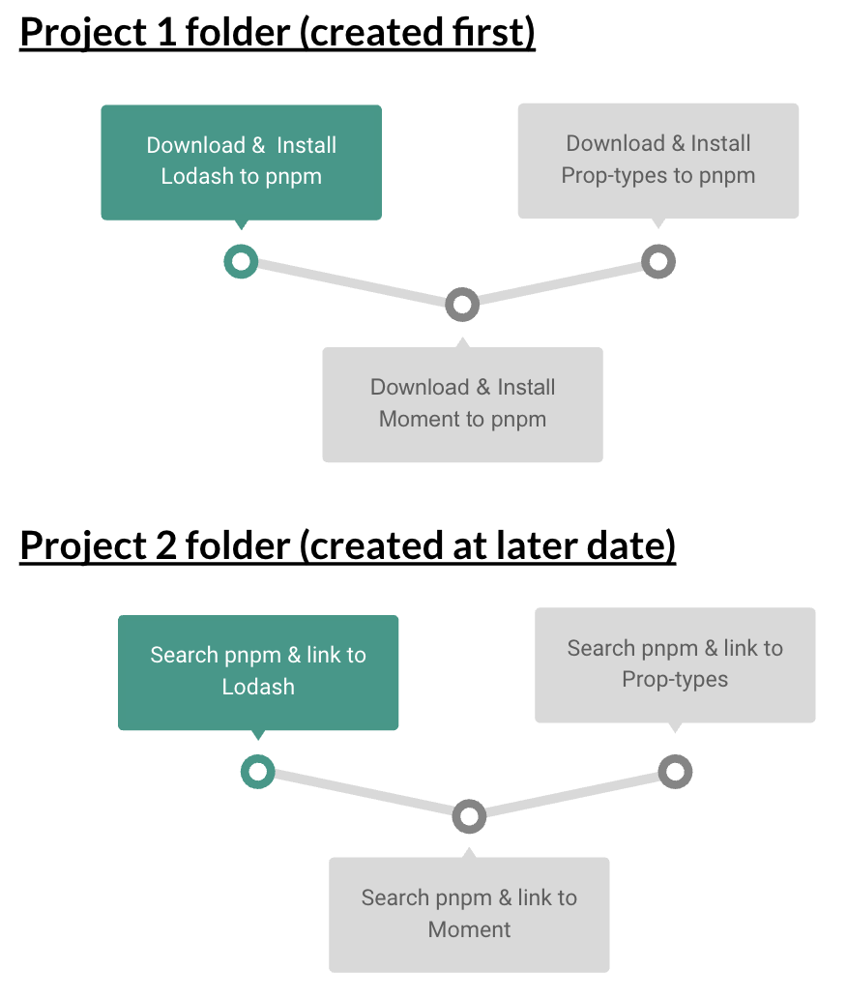
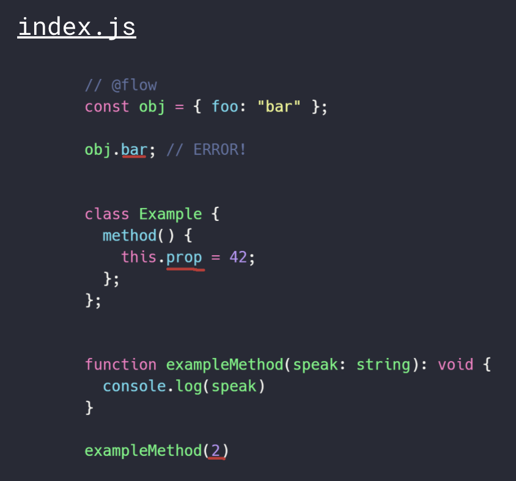
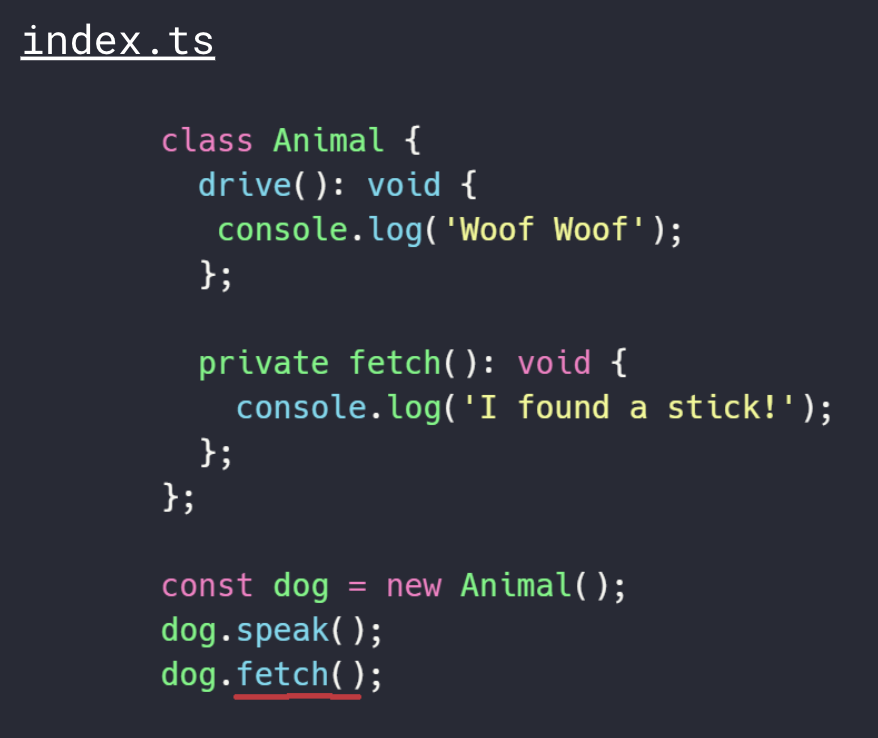
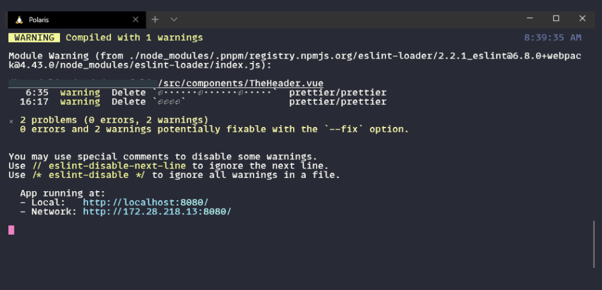
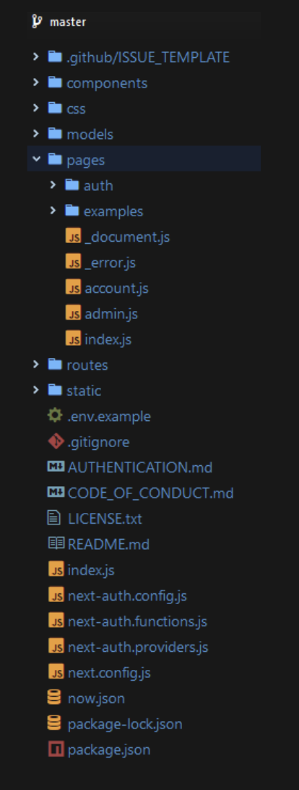
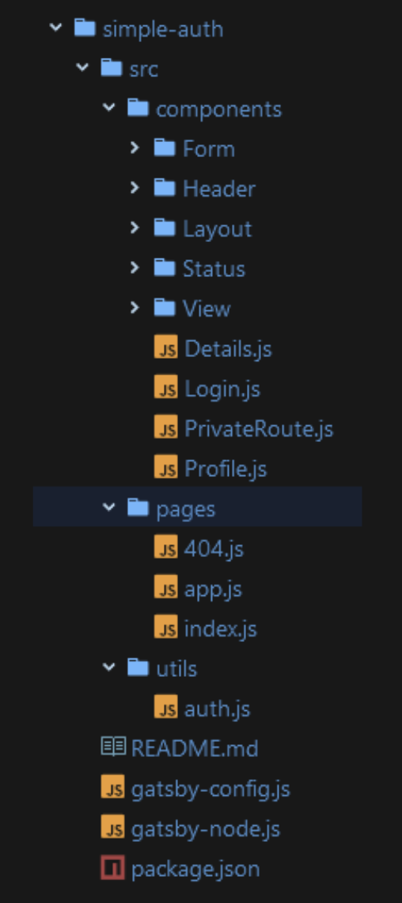

# JavaScript Modern Tooling

> **Alice Balbuena on 05/08/20**

## Package Managers

Packages are small pieces of utility code that allows you to add on to what you can do in JavaScript. Many are open-source. npm is the definitive package registry.

### npm

* Most popular/widely-used
* A website, CLI, and registry
* Installs packages synchronously
  * Always has to download everything
    * Will download a copy of each of your packages \(and their dependencies\) into each of your repositories
  * This is why we don't commit our `node_modules` directory
* Recently purchased by GitHub/Microsoft
  * This purchase adds stability to npm





### Yarn

* Uses the npm registry
* Installs packages in parallel
* Increase in performance as the number of packages grows
* Created by Facebook
  * Now maintained independently from them




### pnpm

* Uses the npm registry
* Uses hard links and symlinks/junctions
* Downloads packages per version, not per project
  * No repeat downloads of same packages across folders
  * WAY faster than npm and Yarn





## Bundlers

Compiles code to make it readable for current browsers.

### Modules

* One JavaScript file is one module
* Can be loaded into other JavaScript files using import and export

#### export

* Makes variables and functions accessible from outside the current module

#### import

* Brings in variables and functions from outside the current module




```javascript
import { speakToGrandma } from './speak'

const speech = speakToGrandma('hello')
console.log(speech)
// HUH!? SPEAK UP, SONNY!
```





```javascript
export function speakToGrandma(speak) {
  if (speak === speak.toUpperCase()) {
    return "NO, NOT SINCE 1938!"
  } else {
    return "HUH!? SPEAK UP, SONNY!"
  }
}
```




### Webpack

* Most popular/very powerful
* Works on frontend and backend
* Takes JavaScript, CSS, images, fonts, etc.
* Extensive plugin ecosystem
* Needs to be setup



### Parcel

* Zero-configuration/zero-setup
* Works on frontend
* Has live reload, babel transforms and transpiling built-in



## Static Type Checking

Type checking is the process of validating and enforcing the rules and constraints of different data types. By default, JavaScript type checks the code while it's running \(dynamic type checking\). Static type checking does this while we're still building. Type inference is when JavaScript infers the type of the variable when it wasn't explicitly set. Explicitly setting the data type is called type annotation.

### Flow

* Out-of-the-box utility
* Works within existing JavaScript files
* Has an opt-in system for implementing throughout the project
* Easy to configure and install with babel
* Built by Facebook
* Implement by putting `// @flow` at the top of any of your `.js` files





### TypeScript

* Open-source programming language
* Along with static type checking adds: interfaces, namespaces, tuples, etc.
* Requires code be written in a special file extension
* Needs compiler to convert TypeScript to JavaScript
  * Have to write code in a `.ts` file
* Developed by Microsoft





## Linters

Analyzes our code syntax and structure and will give errors if something violates your predefined rules.

### ESLint

* Designed to be completely configurable
* Has many presets that can be used to increase functionality
* Supports JSX
* Has the biggest rules system built for it out of any other linter





## Libraries

### React.js

* Very popular and widely used
* Steep learning curve
* Virtual DOM, component-based, state, props, JSX, React hooks
* Focus is solely on the UI layer of the frontend
* Relies on external packages to handle routing and complex state management \(React-Router, Reach-Router, XState, Redux\)
* Has a wide ecosystem of packages
* Built and developed by Facebook

```jsx
// This function takes a component...
function withSubscription(WrappedComponent, selectData) {
  // ...and returns another component...
  return class extends React.Component {
    constructor(props) {
      super(props);
      this.handleChange = this.handleChange.bind(this);
      this.state = {
        data: selectData(DataSource, props)
      };
    }
    
    componentDidMount() {
      // ...that takes care of the subscription...
      DataSource.addChangeListener(this.handleChange);
    }
    
    componentWillUnmount() {
      DataSource.removeChangeListener(this.handleChange);
    }
    
    handleChange() {
      this.setState({
        data: selectData(DataSource, this.props)
      });
    }
    
    render() {
      // ...and renders the wrapped component with the fresh data!
      // Notice that we pass through any additional props
      return <WrappedComponent data={this.state.data} {...this.props} />;
    }
  };
}
```



### Vue.js

* Rapidly gaining in popularity
* Easy to learn
* Virtual DOM, component-based, state, props, templating, compositing API
* Relies on external packages to handle routing and complex state management
  * Unlike React.js, these packages are maintained by the Vue.js core team
* Maintained by the Vue.js core team
* Took the best of React.js and Angular.js and combined them

```jsx
<template>
  <nav>
   <router-link>Home</router-link>
   <router-link>Shop</router-link>
   <router-link v-show="isLoggedIn">Log Out</router-link>
  </nav>
  <button :click="increaseCount">{{count}}</button>
  <MainSection />
</template>

<script>
  import MainSection from '@/components/MainSection';
  
  export default {
    components: {
      MainSection
    },
    data: () => ({
      isLoggedIn: True,
      count: 0
    }),
    methods: {
      increaseCount() {
        return this.count +1;
      }
    },
    mounted: () => {
      this.$nextTick(() => alert("Page is mounted"));
    }
  }
</script>

<scope lang="scss" scoped>
  a, a:visited, a:hover {
    color: white;
  }
</scope>
```



## React Frameworks

### Next.js

* Server-side rendering
* Can also handle static pages
* Automatic hot reloading
* Automatic code splitting
* Includes routing/complex state management out-of-the-box
* TypeScript support





### Gatsby.js

* Static site generator
* Open-source
* JAMstack architecture
* Code splitting
* Powerful image processing
* Uses Reach-Router \(React-Router replacement with better support for accessibility\)





## Slides




